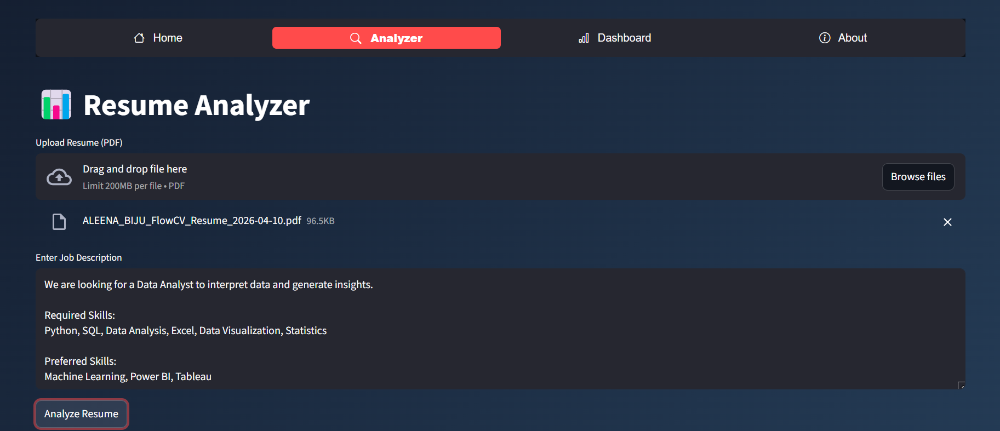
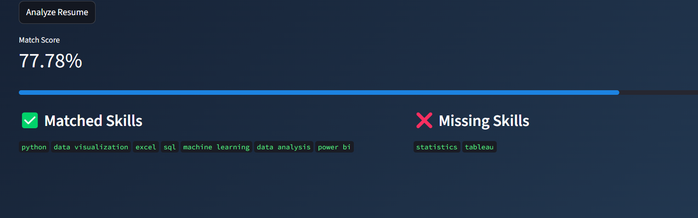
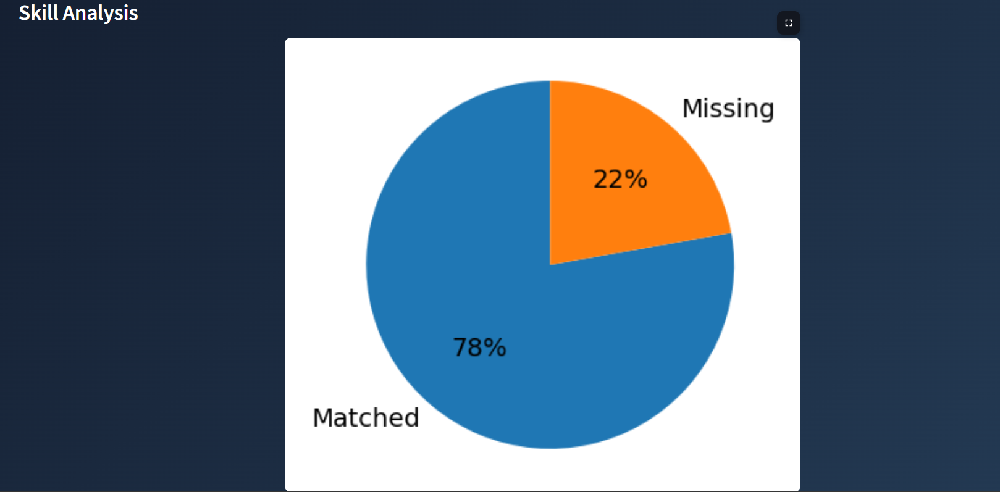

#  AI Resume Screener

An AI-based Resume Screening system that analyzes resumes (PDF/Text), extracts key skills, and matches them with job descriptions using Natural Language Processing (NLP).

---

##  Project Overview

This project automates resume screening by extracting text from uploaded resumes (including PDF files), identifying important skills using NLP, and comparing them with job descriptions to generate a matching score.

It improves hiring efficiency by reducing manual resume evaluation.

---

##  Features

-  Resume upload and text extraction (PDF supported)  
-  PDF parsing using pdfplumber / PyPDF2  
-  NLP-based skill extraction using spaCy  
-  Keyword matching with job description  
-  Candidate scoring system  
-  Resume analysis output  

---

##  Tech Stack

- Python  
- spaCy (NLP)  
- pdfplumber (PDF extraction)

---

##  Screenshots

### Login Page

### Analyzer Page

### Score Output

### Dashboard

---

##  Project Structure
